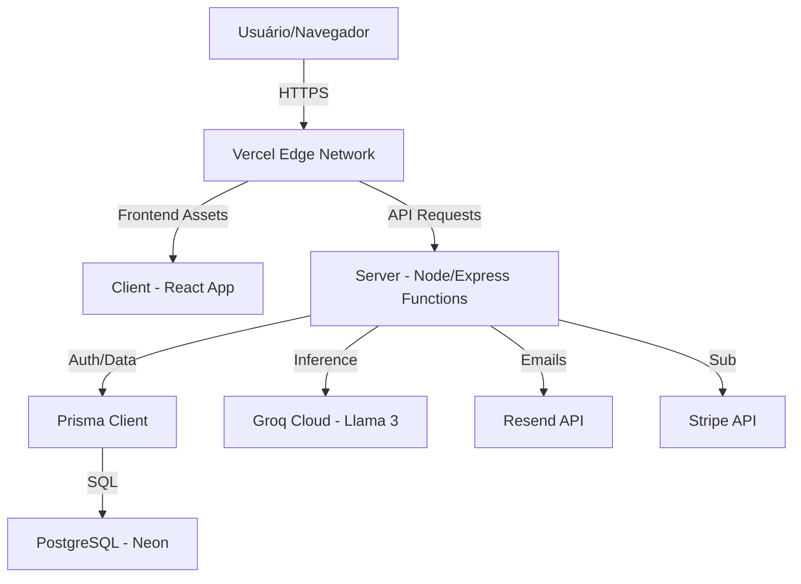

# Blueprint da Aplicação - Sentinela AI 🏗️
## Arquitetura, Fluxos e Design System

Este documento serve como a planta técnica e funcional do **Sentinela AI**, detalhando como os componentes se conectam para entregar a proposta de valor.

---

## 1. Stack Tecnológica (The Core)

A aplicação utiliza uma arquitetura moderna e escalável:
- **Frontend**: React 18 + Vite (Tailwind CSS para interface responsiva).
- **Backend**: Node.js + Express (TypeScript) rodando em arquitetura Serverless (Vercel).
- **Banco de Dados**: PostgreSQL (Hospedado no Neon.tech) com Prisma ORM.
- **Inteligência Artificial**: Groq SDK (Llama-3 70B/8B) para análise em tempo real.
- **E-mail**: Resend API com sistema de fallback robusto.
- **Pagamentos**: Stripe API (Checkout & Subscriptions).

---

## 2. Arquitetura Multitenant (SaaS Separation)

O Sentinela AI utiliza uma estratégia de **Isolamento Lógico via Chave de Estrangeira (`tenantId`)**:
- **Tenant**: Cada hospital possui um `id` e um `slug` únicos.
- **Isolamento**: Todas as queries ao banco de dados são filtradas pelo `tenantId` do usuário logado ou da URL pública.
- **Roteamento**: `https://sentinelaai.com.br/[slug-do-hospital]` permite formulários de notificação customizados por instituição.

---

## 3. Blueprint de Dados (Schema)

### Entidades Principais:
1.  **Tenant**: Nome, slug, data de fundação.
2.  **User**: Credenciais, Role (ADMIN, GESTOR, QUALIDADE), Vínculo com Tenant e Status de Assinatura.
3.  **Incident**: O núcleo do sistema. Armazena dados do paciente, descrição do evento e os campos gerados pela IA (`eventTypeAi`, `riskLevel`, `aiAnalysis`).
4.  **Sector**: Departamentos do hospital (Enfermagem, UTI, etc.).
5.  **Article**: Base de conhecimento interna e conexão com LinkedIn para compartilhamento de boas práticas.

---

## 4. Fluxo de Valor do Incidente (Workflows)

O "Caminho Feliz" da notificação:
1.  **Ingress**: Usuário (anônimo ou logado) submete um relato de incidente.
2.  **AI Processing**:
    *   IA analisa o texto bruto.
    *   Extrai a gravidade (Risco de 1 a 3).
    *   Sugere recomendações imediatas (Contenção).
3.  **Dispatch**: Sistema dispara e-mail para o gestor do setor via `NotificationService`.
4.  **Action Plan**: Gestor preenche o plano de ação assistido por ferramentas de RCA (Root Cause Analysis).
5.  **Escalation**: Se o prazo expira, o motor de governança escalona o evento para a Alta Gestão.

---

## 5. Blueprint de Infraestrutura (Vercel + GitHub)

---

## 6. Design System & UX Principles

### Paleta de Cores Corporativa:
- **Navy Blue (`#003366`)**: Confiança, autoridade e profissionalismo.
- **Crimson Red (`#D32F2F`)**: Alertas críticos e urgência.
- **Emerald Green (`#2E7D32`)**: Segurança e conformidade.
- **Alert Orange (`#FF9800`)**: Atenção e riscos moderados.

### Princípios de Interface:
- **Dashboard Minimalista**: Foco em "O que precisa da minha atenção hoje?".
- **Micro-interações**: Feedbacks visuais ao enviar notificações e gerar análises de IA.
- **Mobile First**: Formulários de notificação otimizados para tablets e celulares em ambiente hospitalar (à beira do leito).

---

## 7. Roadmap de Inteligência (Future Prints)

- **Predição de Surtos**: Identificar padrões de incidentes similares antes que um dano grave ocorra.
- **Importação de Prontuário**: Integração via HL7/FHIR para pré-preencher dados do paciente.
- **Voz para Texto**: Notificação via áudio com transcrição e análise automática.

---
*Este Blueprint é parte integrante da documentação de engenharia e deve ser consultado para novos processos de desenvolvimento.*
