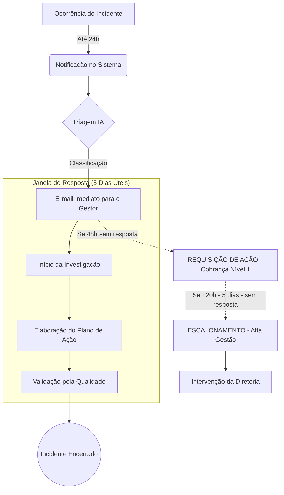

# Fluxo de Governança: Da Notificação à Tratativa 🛡️

Este esquema detalha o ciclo de vida de um incidente no **Sentinela AI**, os prazos regulamentares e os mecanismos de controle caso as responsabilidades não sejam cumpridas.

---

## 🧭 Esquemático do Fluxo

---

## ⏱️ Cronograma de Prazos

| Etapa | Responsável | Prazo | Canal |
| :--- | :--- | :--- | :--- |
| **Notificação** | Colaborador / Anônimo | Imediato (D+0) | App / Link Público |
| **Triagem & Análise IA** | Sentinela AI | Segundos após envio | Dashboard |
| **Início da Tratativa** | Gestor do Setor | Até 48 horas | E-mail de Alerta |
| **Conclusão do Plano** | Gestor do Setor | Até 5 dias (120h) | E-mail de Resumo |
| **Escalonamento** | Motor de Governança | Após 5 dias | E-mail Alta Gestão |

---

## ⚠️ Consequências da Não Entrega (Inadimplência)

O Sentinela AI foi desenhado para que a omissão não seja uma opção. Se a tratativa não for entregue no prazo, ocorrem as seguintes ações:

### 1. Perda de Autonomia Setorial
O incidente deixa de ser uma questão do setor e passa a ser monitorado pela Qualidade e Diretoria. O gestor perde a oportunidade de realizar uma defesa técnica antes do escalonamento.

### 2. Escalonamento para Alta Gestão (Diretoria)
O sistema dispara um e-mail de **Risco Institucional** para os diretores. Este e-mail contém:
- O tempo exato de atraso.
- A descrição da gravidade que a IA detectou.
- Um botão de **Intervenção Direta**, permitindo que o diretor cobre pessoalmente o gestor ou altere a estratégia.

### 3. Exposição em Dashboard Executivo
O setor inadimplente aparece em **vermelho constante** no Dashboard da Qualidade. Isso impacta negativamente nos indicadores de desempenho (KPIs) do setor e na pontuação de segurança da instituição.

### 4. Vulnerabilidade Jurídica
A ausência de um plano de ação após uma notificação formal cria uma prova de "negligência administrativa" em caso de processos judiciais. O Sentinela AI registra que o gestor foi notificado e não agiu, transferindo a responsabilidade da instituição para a gestão específica.

---
*A melhor tratativa é a prevenção. O Sentinela AI garante que nenhum erro seja esquecido embaixo do tapete.*
