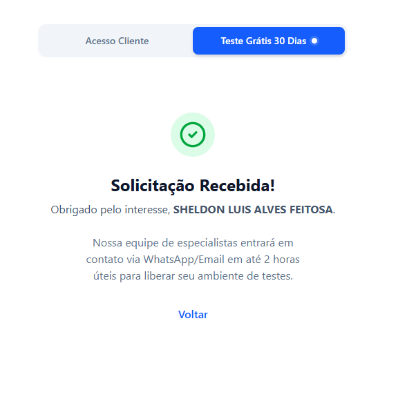

# Blueprint do Projeto: Sentinela AI (SaaS Edition)

## 1. Visão Geral (Overview) e Modelo de Negócio
O **Sentinela AI** evoluiu para uma plataforma **SaaS (Software as a Service) B2B** destinada a hospitais e clínicas.
O objetivo é fornecer uma solução "Plug & Play" onde cada instituição possui seu ambiente seguro, personalizado e isolado, pagando por assinatura.

### Diferenciais Premium
*   **Multi-tenancy Nativo:** Dados de diferentes hospitais totalmente isolados.
*   **Compliance Health Tech:** Foco total em LGPD/HIPAA com logs de auditoria imutáveis.
*   **Onboarding Zero-Touch:** Provisionamento automático de novos clientes.

## 2. Arquitetura SaaS (Multi-tenant)
A arquitetura foi refinada para escalar horizontalmente:

*   **Estratégia de Multi-tenancy:** Isolamento Lógico (Row-level Security). Todas as tabelas críticas possuem `tenantId` (ID da Instituição), garantindo que um hospital *jamais* veja dados de outro.
*   **API Gateway / Load Balancer:** Ponto único de entrada que gerencia rate-limiting e roteamento por subdomínio (ex: *hospital-a.sentinela.ai*).
*   **Database:** PostgreSQL gerenciado (Supabase/Neon) com suporte a RLS (Row Level Security) para segurança em profundidade.
*   **Motor de IA:** Agnostic Layer. Abstração que permite trocar o provedor de IA (OpenAI, Anthropic, Gemini) conforme custo/performance, sem afetar o cliente.

## 3. Segurança e Controle de Acesso (Enterprise Grade)
Segurança não é feature, é premissa.

*   **Autenticação Unificada:**
    *   **Public Link:** Tokens temporários ou links assinados para notificações anônimas mas rastreáveis (origem).
    *   **Gestão (SSO):** Suporte futuro a Single Sign-On (SAML/OIDC) para grandes hospitais.
*   **RBAC (Role-Based Access Control):**
    *   `SUPER_ADMIN`: Nós (Devs). Acesso a métricas globais e faturamento.
    *   `TENANT_ADMIN`: Gestor do Hospital. Configura usuários e vê todos os incidentes da sua unidade.
    *   `RISK_ANALYST`: Analista. Pode ver e tratar incidentes, mas não configurar o sistema.
    *   `USER`: Notificador básico (opcionalmente logado).
*   **Auditoria (Audit Logs):** *Quem* fez *o que* e *quando*. Essencial para compliance jurídico.

## 4. Estrutura de Diretórios (SaaS Monorepo)
O projeto está organizado como um *monorepo* (ou estrutura unificada) dentro da pasta `sentinela-app`:

```text
sentinela-app/
├── client/                 # Frontend Application
│   ├── src/
│   │   ├── components/     # Componentes Reutilizáveis (Ex: IncidentForm, InvestigationChat)
│   │   ├── pages/          # Páginas da Aplicação
│   │   ├── services/       # Comunicação com a API
│   │   ├── hooks/          # Lógica de estado e efeitos (React Hooks)
│   │   └── App.tsx         # Ponto de entrada da UI
│   ├── package.json        # Dependências do Frontend
│   └── vite.config.ts      # Configuração do Build
│
└── server/                 # Backend API
    ├── src/
    │   ├── controllers/    # Controladores da API (Recebem requisições)
    │   ├── routes/         # Definição das rotas (Endpoints)
    │   ├── services/       # Lógica de Negócios e IA (ai.service.ts, email.service.ts)
    │   ├── server.ts       # Ponto de entrada do Servidor
    │   └── prisma/         # Schema do Banco de Dados
    └── package.json        # Dependências do Backend
```

## 5. Stack Tecnológico

### Frontend
*   **Core:** React, TypeScript, Vite
*   **Estilização:** Tailwind CSS (Utilitários), Lucide React (Ícones)
*   **Gerenciamento de Estado:** React Hooks
*   **Comunicação:** Axios/Fetch

### Backend (API & Worker)
*   **Runtime:** Node.js (Ecosistema maduro) / Bun (Performance).
*   **Framework:** NestJS ou Fastify (para maior robustez e tipagem que o Express puro) - *Recomendado para SaaS*.
*   **Database ORM:** Prisma (excelente DX e tipagem segura).
*   **Queue System:** BullMQ / Redis (para processamento assíncrono de notificações de IA e e-mails massivos).
*   **Validation:** Zod (Tipagem runtime rigorosa).

### Integrações de IA & Serviços Externos
*   **Google Gemini (`@google/generative-ai`):** Processamento primário de linguagem.
*   **Groq SDK (`groq-sdk`):** Inferência rápida (provável para classificação em tempo real).
*   **OpenAI:** Fallback ou modelos específicos.
### Infraestrutura & DevOps
*   **CI/CD:** GitHub Actions (Testes, Build, Deploy automáticos).
*   **Hosting:** Vercel (Frontend) + Railway/Render (Backend & DB).
*   **Monitoramento:** Sentry (Erros), Datadog/NewRelic (Performance).

## 6. Módulos e Funcionalidades Chave

### A. Relato e Classificação Inteligente
*   **Entrada:** O usuário descreve o incidente em linguagem natural no `IncidentForm.tsx`.
*   **Processamento:** O `ai.service.ts` no backend recebe o texto.
*   **Saída:** A IA classifica automaticamente o tipo de incidente, severidade e taxonomia.

### B. Investigação e Chat
*   **Componentes:** `FiveWhysAnalysis.tsx` (Metodologia 5 Porquês) e `InvestigationChat.tsx`.
*   **Função:** Auxiliar gestores a encontrar a causa raiz do problema através de um chat interativo com a IA.

### C. Gestão e Notificações
*   **Serviços:** `risk-manager.service.ts`, `notification.service.ts`.
*   **Função:** Alerta gestores de risco (`create_ea_notification.ts`, `create_nc_notification.ts`) sobre incidentes críticos via e-mail.

### D. Dashboards
*   **Serviço:** `dashboard.service.ts`.
*   **Função:** Agregação de dados para visualização de tendências e áreas de risco.

## 7. Fluxo de Funcionamento (Exemplo)
1.  **Usuário (Sem Login)** acessa o link público e relata: "Paciente caiu ao tentar ir ao banheiro".
2.  **Frontend** envia o texto para `POST /api/incidents`.
3.  **Backend** chama `ai.service.ts` → Envia prompt para Gemini/Groq.
4.  **IA** analisa e retorna: `{ tipo: "Queda", severidade: "Moderada", local: "Banheiro" }`.
5.  **Backend** salva no banco via Prisma e aciona `notification.service.ts`.
6.  **Gestor (Logado)** recebe e-mail, clica no link, faz login no sistema e acessa o painel para análise de causa raiz.
